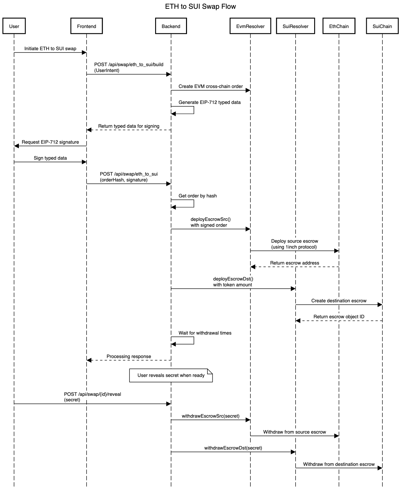
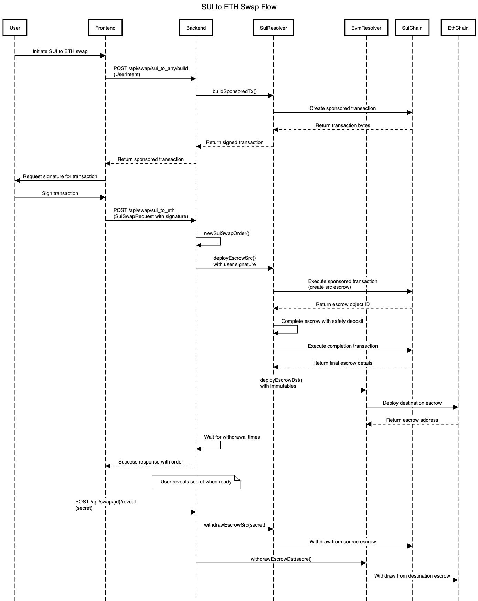

# Nether Swap - Unite Defi 

Nether Swap is a cross-chain decentralized exchange protocol that enables seamless swapping of assets across different blockchain networks. The platform leverages 1inch crosschain contracts and SDK for Ethereum networks, while implementing custom contracts and resolver/client solutions for SUI integration.

## Deployments

### Arbitrum

| Contract | Address |
|----------|----------|
| LimitOrderProtocol | [`0x9146cd8fa9A235ba4635A3f8A598C2bCfd453a27`](https://arbiscan.io/address/0x9146cd8fa9A235ba4635A3f8A598C2bCfd453a27) |
| EscrowFactory | [`0x799924E2F7D46aF3e328d74e0993583698782a1e`](https://arbiscan.io/address/0x799924E2F7D46aF3e328d74e0993583698782a1e) |
| Resolver | [`0x9B68a0F27Ea511AAb1eeB2e77077e37b738ce46b`](https://arbiscan.io/address/0x9B68a0F27Ea511AAb1eeB2e77077e37b738ce46b) |

### SUI

| Contract | Address |
|----------|---------|
| HTLC Package | [`0x5abe7a273c93a3d3288a8f5721046970f7577081c593645f5f0887c81bd8c869`](https://suiscan.xyz/mainnet/object/0x5abe7a273c93a3d3288a8f5721046970f7577081c593645f5f0887c81bd8c869) |

## Getting Started

### SUI Contract Deployment

1. Install SUI CLI:
   ```bash
   # Follow instructions at https://docs.sui.io/guides/developer/getting-started/sui-install
   ```
2. Request faucet tokens for testnet:
   ```bash
   sui client faucet
   ```
3. Deploy contracts:
   ```bash
   make deploy
   ```

### Backend Setup

1. Configure environment variables (see `.env.example` for required variables)
2. Navigate to the backend directory and run:
   ```bash
   cd backend/
   npm i
   npm run start
   ```




