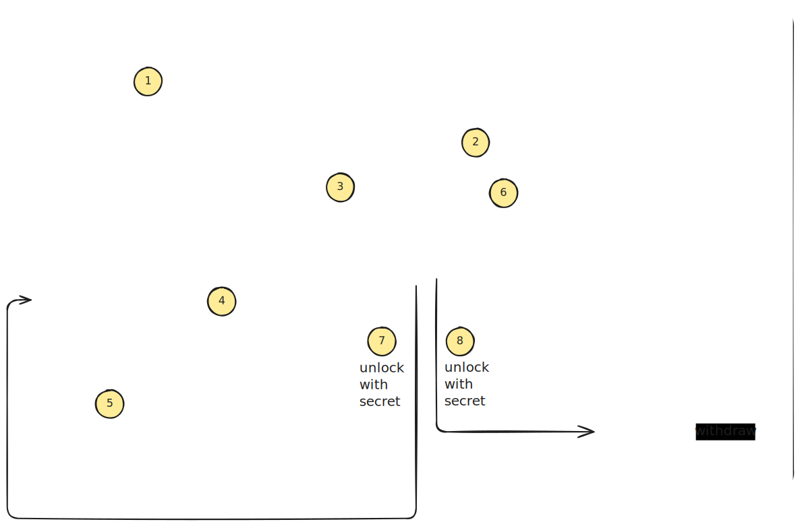

# How 1inch works on EVM

## Draw overview



1. `Maker` (User) submit a swap request with `signature` and `secretHash` to 1Inch API.
2. `Taker` (Resolver), which want to process swap, take swap request.
3. `Taker` fill order, using `Limit Order Protocol` on Source Chain.
4. `Limit Order Protocol` execute callback, after successful fill order.
5. This callback, create `EscrowSrc` on Source Chain with `secretHash`, `safeDeposit`, `makerAsset`.
6. `Taker` create `EscrowDst` on Destination Chain with `secretHash`, `safeDeposit`, `takerAsset`.

`Taker` receive `secret` from `Maker`.

7. `Taker` withdraw `takerAsset` from `EscrowDst` to `Maker` on Destination Chain.
8. `Taker` withdraw `makerAsset` from `EscrowSrc` to `Taker` on Source Chain.


## Links

* Core Contracts: https://github.com/1inch/cross-chain-swap
* SDK: https://github.com/1inch/cross-chain-sdk
* Resolver Example: https://github.com/1inch/cross-chain-resolver-example
* Fusion+ API: https://portal.1inch.dev/documentation/apis/swap/fusion-plus/fusion-plus-sdk/for-integrators/sdk-overview

## Escrow Contracts

### EscrowSrc

Contract to initially lock funds and then unlock them with verification of the secret presented. Funds are locked in at the time of contract deployment.

| Method | Description | Time Interval |
|--------|-------------|---------------|
| `withdraw(bytes32 secret, Immutables calldata immutables)` | Allows the taker to withdraw funds by providing the correct secret | After SrcWithdrawal timelock and before SrcCancellation timelock |
| `withdrawTo(bytes32 secret, address target, Immutables calldata immutables)` | Allows the taker to withdraw funds to a specified target address | After SrcWithdrawal timelock and before SrcCancellation timelock |
| `publicWithdraw(bytes32 secret, Immutables calldata immutables)` | Allows access token holders to withdraw funds on behalf of the taker | After SrcPublicWithdrawal timelock and before SrcCancellation timelock |
| `cancel(Immutables calldata immutables)` | Allows the taker to cancel the escrow and return funds to the maker | After SrcCancellation timelock |
| `publicCancel(Immutables calldata immutables)` | Allows access token holders to cancel the escrow on behalf of the maker | After SrcPublicCancellation timelock |

### EscrowDst

Contract to initially lock funds and then unlock them with verification of the secret presented. Funds are locked in at the time of contract deployment when the taker calls the `EscrowFactory.createDstEscrow` function.

| Method | Description | Time Interval |
|--------|-------------|---------------|
| `withdraw(bytes32 secret, Immutables calldata immutables)` | Allows the taker to withdraw funds by providing the correct secret | After DstWithdrawal timelock and before DstCancellation timelock |
| `publicWithdraw(bytes32 secret, Immutables calldata immutables)` | Allows access token holders to withdraw funds on behalf of the taker | After DstPublicWithdrawal timelock and before DstCancellation timelock |
| `cancel(Immutables calldata immutables)` | Allows the taker to cancel the escrow and return funds to themselves | After DstCancellation timelock |

### Immutables

```solidity
struct Immutables {
    bytes32 orderHash;
    bytes32 hashlock;  // Hash of the secret.
    Address maker;
    Address taker;
    Address token;
    uint256 amount;
    uint256 safetyDeposit;
    Timelocks timelocks;
}

// Timelocks store the number of seconds from the time the contract is deployed to the start of a specific period.
type Timelocks is uint256;
```
